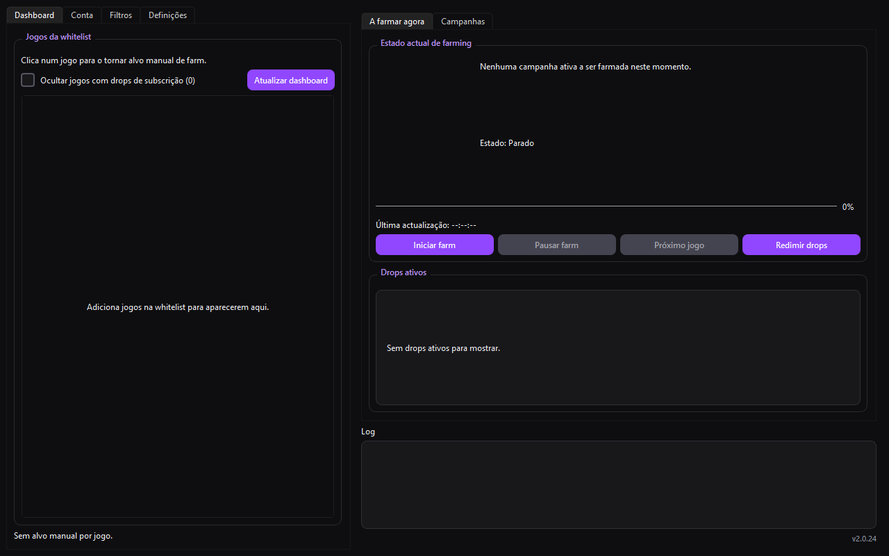
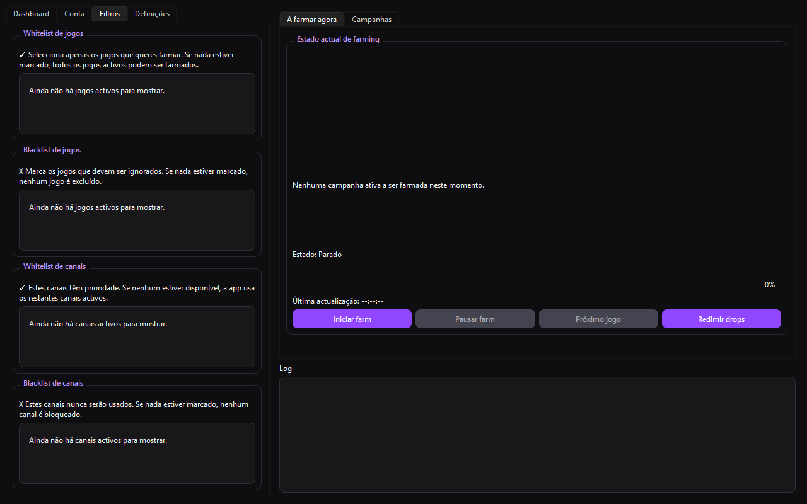
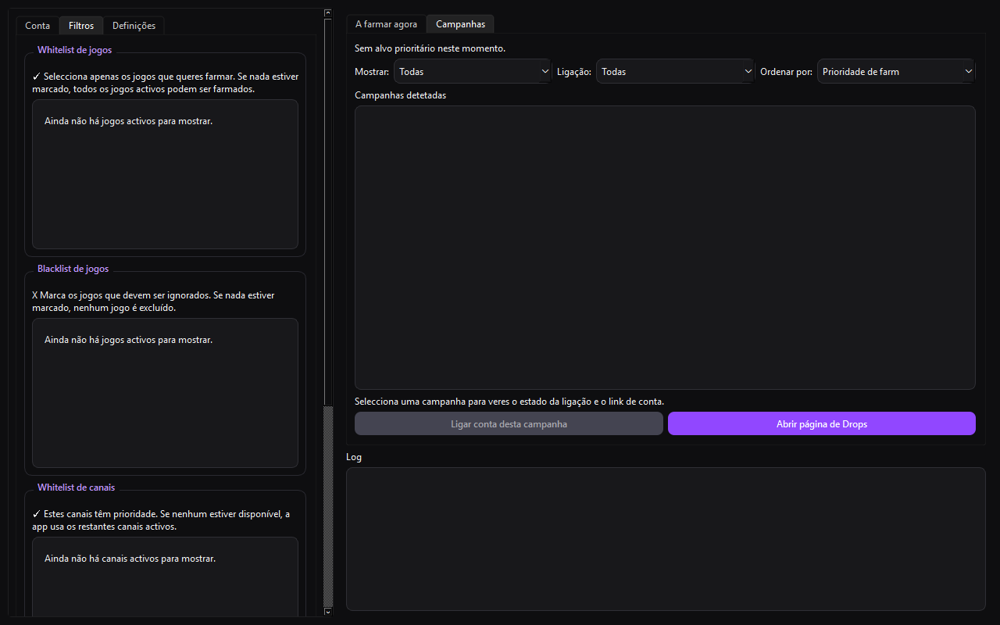
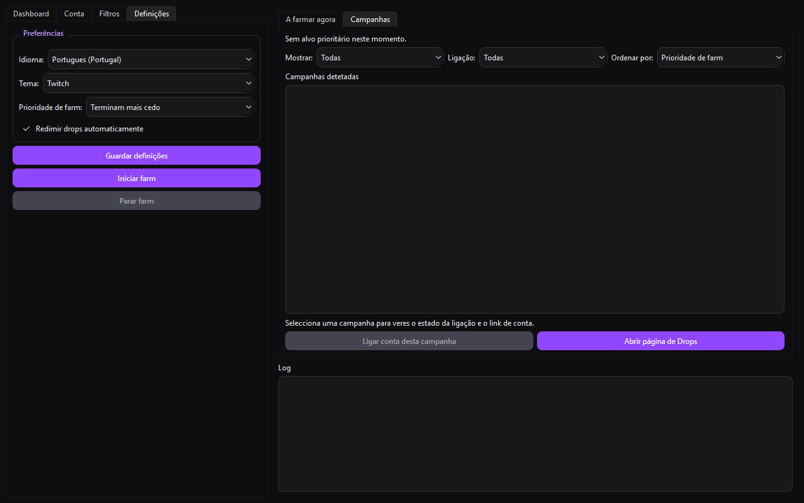

# Twitch Drop Farmer

[PT-PT](README.md) | [EN](README.en.md)

A Python + PySide6 desktop app to automate Twitch Drops farming with local control, campaign filters, and automatic channel rotation.

Current version: `2.0.24`

## About the project

Twitch Drop Farmer has evolved into a more resilient and predictable farming client:

- Dashboard states now reflect real campaign outcomes (Active, Not started, No stream, Completed, Lost, Subscription required).
- Manual game targeting is now sticky and avoids unexpected automatic switches.
- Filters are reorganized into sub-tabs with search and bulk actions (select/clear all and visible).
- Farming context remains clearer even when a valid stream is temporarily unavailable.
- Automation is designed for stable local operation without external service dependencies.
- Diagnostics and update checks provide clearer status and compact test reporting.

## Highlights

- Automatic campaign discovery (active and upcoming)
- Best-target farming selection logic
- Auto-switch between channels
- Whitelist and blacklist filters (games and channels)
- Manual and automatic drop redemption
- Real-time farming status (game, campaign, channel, progress, ETA)
- Durable session JSON import/export mode

## What's new in 2.0.24

- Fixed false critical OAuth diagnostic failures for durable session users.
- Diagnostics now run in a safe mode without rendered browser fallback in worker threads.
- Added compact diagnostic report table (`Test | Status | Time | Message`).
- Improved subscription-only hiding logic for campaigns with missing actionable metadata.
- Dashboard grid now compacts correctly after hidden-game filtering.
- Fixed manual target behavior so selected games stay selected reliably.

## Quick Start

### Windows (PowerShell)

```powershell
python -m venv .venv
.\.venv\Scripts\Activate.ps1
python -m pip install -r requirements.txt
$env:PYTHONPATH="src"
python -m twitch_drop_farmer
```

### Linux/macOS

```bash
python -m venv .venv
source .venv/bin/activate
python -m pip install -r requirements.txt
PYTHONPATH=src python -m twitch_drop_farmer
```

## Build EXE (Windows)

```powershell
.\build_exe.ps1
```

Generated binary:

- dist\TwitchDropFarmer\TwitchDropFarmer.exe
- dist\TwitchDropFarmer-win64.zip

Notes:

- The build now uses `onedir` to avoid an oversized single-file executable with Qt WebEngine.
- The generated ZIP is the recommended release artifact for distribution.

## GitHub Releases

- `v*` tags can now trigger an automated Windows release build through GitHub Actions.
- The release publishes `TwitchDropFarmer-win64.zip` as an asset.
- Release notes for this version: `docs/releases/v2.0.24.en.md` and `docs/releases/v2.0.24.pt-PT.md`.

## Authentication

Use your Twitch auth-token cookie value inside the app (Account tab).

- Paste only the cookie value
- Do not include the cookie name
- Do not include the OAuth prefix

Durable session alternative:

- Import session JSON in the Account tab.
- Save and refresh.

## Privacy and Security

- Credentials and session artifacts are stored locally.
- Sensitive data must never be published in issues or commits.
- The repository includes ignore rules to prevent common local data leaks.
- Responsible disclosure policy: `SECURITY.md`.

## Screenshots

### Dashboard



### Farming View



### Campaigns View



### Settings View



## Notes

- Twitch APIs and GraphQL behavior may change over time.
- If endpoints change, query hashes and parsing logic may need updates.

## License

This project is licensed under the MIT License. See LICENSE for details.
